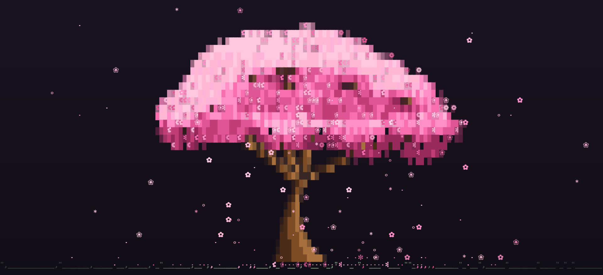

# csakura 2.0 🌸

[](#clone-tracking)
[](https://github.com/realstrawhat/csakura/stargazers)
[](LICENSE)

A sakura tree with falling petals for your terminal — in the spirit of
`cmatrix` and `cava`, but prettier.



- Procedurally grown cherry-blossom tree (different every run, press `r` to regrow)
- Petals drift down on a wandering wind, settle on the ground, and fade
- Auto-adjusts to any terminal size, regenerates on resize
- Written in C99 + ncurses, low CPU (default 20 FPS)
- 15 blossom color palettes (`-c` / press `c`)
- [Live keyboard shortcuts](#shortcuts) for every setting — palette, petals,
  wind, speed, ASCII and flat mode, all without restarting
- Matching HTML demo in [`web/`](web/)

## What's new in 2.0

The tree is grown rather than stamped. The canopy now follows the limbs that
were actually generated instead of a fixed arrangement of blobs, so no two
crowns share a silhouette:

- **Clumped blossom.** Two octaves of value noise break the crown into
  clusters, with a per-column wobble roughing up the outline — a cherry, not a
  smooth dome.
- **Directional light.** Light falls from the upper left and the mass shades
  what hangs below it, so the crown has volume instead of a flat tint.
- **Limbs through the blossom.** Branches show through where the clusters
  thin, following the noise field so a limb emerges as a continuous run rather
  than a scatter of dashes.
- **Smooth taper.** Trunk and branches use partial block glyphs (`░▒▓`) at
  their edges, so the wood curves instead of stepping, and the trunk keeps its
  proportion to the crown at every terminal size.
- **Shaded cells.** Canopy cells sit on a dark tint of the blossom colour, and
  the block glyphs blend the ramp step against it — this is what lets eight
  colours read as a solid, saturated mass with a fringe that dissolves.
- **Sane at any shape.** A short split, a tall narrow pane, or a full screen
  all get a correctly proportioned tree rather than a pancake or a lamppost.

The shaded cells mean csakura paints a background behind the canopy, so a
transparent terminal no longer shows through it. Pass `-t` (or press `t`) for
flat mode, which never paints cell backgrounds and keeps your terminal — or
your wallpaper — visible behind the tree.

## Install

### Arch Linux

From the AUR, with `yay` (or `paru`):

```sh
yay -S csakura        # latest release
yay -S csakura-git    # builds from main
```

Or build the PKGBUILD by hand:

```sh
sudo pacman -S --needed base-devel ncurses
git clone https://github.com/realstrawhat/csakura.git
cd csakura
makepkg -si
```

Or without pacman at all:

```sh
make && sudo make install
```

Uninstall: `sudo pacman -R csakura` or `sudo make uninstall`.

### macOS

With [Homebrew](https://brew.sh). This repository doubles as its own tap, so
there is nothing to clone by hand:

```sh
brew tap realstrawhat/csakura https://github.com/realstrawhat/csakura
brew install realstrawhat/csakura/csakura         # latest release
brew install --HEAD realstrawhat/csakura/csakura  # builds from main
```

Once the tap is added, plain `brew install csakura` works too, as long as no
other tap you have provides that name. Homebrew pulls in `ncurses` itself.

Or build yourself:

```sh
brew install ncurses
git clone https://github.com/realstrawhat/csakura.git
cd csakura
make
sudo make install
```

Then run `csakura`. Uninstall with `brew uninstall csakura` (and
`brew untap realstrawhat/csakura`) or `sudo make uninstall`.

### Other Linux

Need a C compiler + wide-char ncurses (`libncursesw5-dev` / `ncurses-devel`):

```sh
git clone https://github.com/realstrawhat/csakura.git
cd csakura
make && sudo make install
```
## Usage

```
csakura [options]

  -f FPS    frames per second, 5-60 (default: 20)
  -p NUM    petal density, 1-10 (default: 5)
  -w NUM    wind strength, 0-10 (default: 1)
  -c NAME   blossom palette (default: sakura)
  -a        ASCII glyphs only (no unicode blossoms)
  -t        flat mode: never paint cell backgrounds, so a
            transparent terminal shows through the canopy
  -h        help
  -v        version

palettes:
  sakura, rose, blush, magenta, peach,
  coral, sunset, gold, lavender, violet,
  sky, mint, matcha, white, ink
```

Examples:

```sh
csakura                 # default
csakura -f 12 -p 3      # chill / low CPU (nice in a side pane)
csakura -p 10 -w 6      # windy petal storm
csakura -c mint         # mint palette
csakura -t              # let a transparent terminal show through
```

## Shortcuts

Everything is tunable live — you never need to restart to try a setting.

| Key       | Does                                                  |
|-----------|-------------------------------------------------------|
| `q`/`Esc` | quit                                                  |
| `r`       | regrow the tree (new shape every time)                |
| `c` / `C` | next / previous color palette (15 of them)            |
| `p` / `P` | more / fewer petals                                   |
| `w` / `W` | more / less wind                                      |
| `+` / `-` | faster / slower                                       |
| `a`       | toggle ASCII glyphs — for fonts without the blossoms  |
| `t`       | toggle flat mode — lets a transparent terminal through |

Uppercase letters are shifted, so `C` is <kbd>Shift</kbd>+<kbd>c</kbd>.

The same keys work in the [web version](web/), which also has a click-through
panel behind the faint ⋮ in the corner.

## Web version

Open [`web/index.html`](web/index.html) in a browser for the same animation.
The faint ⋮ in the corner opens the full set of controls — palette, petal
density, wind, speed, ASCII glyphs and flat mode — and the terminal keys all
work too (`r` `c`/`C` `a` `t` `p`/`P` `w`/`W` `+`/`-`). Settings persist across
visits. You can also enable GitHub Pages on the `/web` folder for a live demo.

The bottom-left corner shows the running total of repository clones, counted up
on screen when it moves. Hover it for the breakdown. See
[Clone tracking](#clone-tracking) for how it is collected.

## Clone tracking

`.github/workflows/traffic.yml` records how many times the repo has been
cloned. The total is shown by the **clones** badge at the top of this file and
in the corner of `web/index.html`, both reading the same published figure.

GitHub's traffic API is **not public** — it needs a token with push access — so
the browser cannot read it directly. The workflow queries it from CI instead
and publishes a plain `traffic.json` to the orphan `traffic-data` branch, which
the page reads unauthenticated. Nothing is ever written to `main`, and the
commits land off the default branch so they stay out of the contributor list.

The API also only serves a **rolling 14-day window**. A total read straight
from it would shrink as old days expired, so the workflow folds each window
into a permanent record keyed by date. The merge is idempotent: re-running it
replaces a day's entry rather than adding to it, so a partial count for the
current day is corrected on the next run and repeated runs cannot double-count.

### Setup

1. Create a fine-grained PAT scoped to this repo with **`Administration:
   Read-only`** — no other permission — and save it as the repository secret
   **`TRAFFIC_TOKEN`**. It is needed because the built-in `GITHUB_TOKEN` cannot
   reach the traffic API: Actions' `permissions:` block has no `administration`
   key. The PAT is used for nothing else; the branch push runs on
   `GITHUB_TOKEN`, so the PAT stays read-only and a leak of it cannot modify
   anything.
2. Seed the data branch with the history collected so far, otherwise the first
   scheduled run starts from zero:

   ```sh
   git checkout --orphan traffic-data
   git rm -rf .
   git show main:scripts/traffic-seed.json > traffic.json
   git add traffic.json && git commit -m "traffic: seed"
   git push -u origin traffic-data
   git checkout main
   ```

3. Run the workflow once from the Actions tab to confirm the token works.

### Reading the numbers

- **clones.total** is the headline: `measured + baseline`.
- **measured** is what the workflow actually recorded.
- **baseline** is a manual figure for traffic from before collection started.
  GitHub had already discarded those days, so it is an estimate that no API can
  confirm. It is kept as its own field, and shown separately in the tooltip, so
  the recorded days stay auditable.
- **uniques** is a sum of per-day unique cloners, which counts one person who
  clones on three days as three. GitHub only dedupes inside a single 14-day
  window — for the seed data its own window figure is 271 against a daily sum
  of 286. Treat it as an upper bound on people, never a headcount.

## Notes

- Best with a 256-color terminal (kitty, iTerm2, or modern Terminal.app). The
  shaded canopy needs 256 colors; on an 8-color terminal csakura falls back to
  flat mode automatically.
- Unicode blossoms need a font that has them (most Nerd Fonts do). Use `-a` if not.
- On macOS, Homebrew’s `ncurses` is recommended for the best color support.
- Running over a transparent or image background? Use `-t`.

## Attribution

If you use csakura, please credit **realstrawhat**  
(https://github.com/realstrawhat/csakura).

## License

MIT
